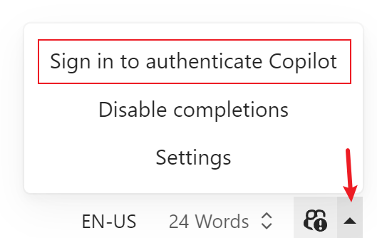

# Typora Copilot

English | [简体中文](./README.zh-CN.md)


[GitHub Copilot](https://github.com/features/copilot) plugin for [Typora](https://typora.io/), provided through [Copilot.vim](https://github.com/github/copilot.vim).

This plugin uses the LSP server extracted from Copilot.vim to provide suggestions in real-time right from your editor.

**⚠️ Warning:** This plugin is still in development and may not work properly. Please use it with caution.

_macOS is not supported yet. Besides, this plugin has not been fully tested on Linux, but it should work properly._

## Compatiblility

_\*Note: `/` means not tested._

**⚠️ Warning:** For users using Typora < 1.6, you need to install [Node.js](https://nodejs.org/en/download/) ≥ 18.

| Typora Version | Windows 11 | Ubuntu 22.04 | macOS 14.2 |
| -------------- | ---------- | ------------ | ---------- |
| 1.7.6          | √          | /            | ×          |
| 1.6.7          | √          | /            | ×          |
| 1.6.4-dev      | √          | /            | ×          |
| 1.5.12         | √          | /            | ×          |
| 1.4.8          | √          | /            | ×          |
| 1.3.8          | √          | /            | ×          |
| 1.2.5          | √          | /            | ×          |
| 1.2.3          | √          | /            | ×          |
| 1.0.3          | √          | /            | ×          |
| 0.11.18-beta   | √          | /            | ×          |

## Prerequisites

- Public network connection.
- Active GitHub Copilot subscription.

## Installation

### Script Install (Recommended)

For all platform users, first download the latest release from [the releases page](https://github.com/Snowfly-T/typora-copilot/releases) and unzip it.

Then for Windows users, locate to the folder where you unzipped the release and run the following command in PowerShell **as administrator**:

```powershell
.\bin\install_windows.ps1
```

If the script fails to find Typora, you can specify the path to Typora manually:

```powershell
.\bin\install_windows.ps1 -Path "C:\Program Files\Typora\" # Replace with your Typora path
# Or use the alias
# .\bin\install_windows.ps1 -p "C:\Program Files\Typora\" # Replace with your Typora path
```

You’ll see a message logging the installation directory of the plugin. _Keep it in mind, you’ll need it when uninstalling the plugin._ After that, you can safely delete the release folder.

For Linux users, locate to the folder where you unzipped the release and run the following command in terminal:

```bash
sudo bash ./bin/install_linux.sh
```

If the script fails to find Typora, you can specify the path to Typora manually:

```bash
sudo bash ./bin/install_linux.sh --path "/usr/share/typora/" # Replace with your Typora path
# Or use the alias
# sudo bash ./bin/install_linux.sh -p "/usr/share/typora/" # Replace with your Typora path
```

You’ll see a message logging the installation directory of the plugin. _Keep it in mind, you’ll need it when uninstalling the plugin._ After that, you can safely delete the release folder.

### Manual Install

_The following instructions for macOS users are only left here for future reference. macOS is not supported yet._

1. Download the latest release from [the releases page](https://github.com/Snowfly-T/typora-copilot/releases) and unzip it.
2. For Windows / Linux users, find `window.html` in your Typora installation folder, usually located at `<typora_root_path>/resources/`; For macOS users, find `index.html` in your Typora installation folder, usually located at `<typora_root_path>/Contents/Resources/TypeMark/`. `<typora_root_path>` is the path where Typora is installed, replace it with your real Typora installation path (note that the angle brackets `<` and `>` should also be removed). This folder is called Typora resource folder in the following steps.
3. Create a folder named `copilot` in Typora resource folder.
4. Copy the downloaded release to the `copilot` folder.
5. For Windows / Linux users, open the previous `window.html` file you found in Typora resource folder with a text editor, and add `<script src="./copilot/index.js" defer="defer"></script>` right after something like `<script src="./appsrc/window/frame.js" defer="defer"></script>` or `<script src="./app/window/frame.js" defer="defer"></script>`; For macOS users, open the previous `index.html` file you found in Typora resource folder with a text editor, and add `<script src="./copilot/index.js" defer></script>` right after something like `<script src="./appsrc/main.js" aria-hidden="true" defer></script>` or `<script src="./app/main.js" aria-hidden="true" defer></script>`.
6. Restart Typora.
7. For macOS users, if you see a warning dialog saying Typora may be damaged, Ctrl-click Typora and select “Open” to open Typora.

## Setup

When finished installation, you'll find an icon in the toolbar of Typora. Click it to open the panel of Copilot, and then click “Sign in to authenticate Copilot”.



Follow the prompts to authenticate Copilot plugin:

1. The User Code will be auto copied to your clipboard.
2. Follow the instructions on the pop-up dialog to open the GitHub authentication page in your browser.
3. Paste the User Code into the GitHub authentication page.
4. Return to Typora and press OK on the dialog.
5. If you see a “Copilot Signed In” dialog _after a few seconds_, Copilot plugin should start working since then.

## Uninstallation

### Script Uninstall (Recommended)

For Windows users, locate to the installation directory of the plugin and run the following command in PowerShell **as administrator**.

```powershell
.\bin\uninstall_windows.ps1
```

You can still specify the path to Typora manually by adding `-Path` or `-p`, just like the installation script.

For Linux users, locate to the installation directory of the plugin and run the following command in terminal.

```bash
sudo bash ./bin/uninstall_linux.sh
```

You can still specify the path to Typora manually by adding `--path` or `-p`, just like the installation script.

### Manual Uninstall

_The following instructions for macOS users are only left here for future reference. macOS is not supported yet._

1. For Windows / Linux users, find `window.html` in your Typora installation folder, usually located at `<typora_root_path>/resources/`; For macOS users, find `index.html` in your Typora installation folder, usually located at `<typora_root_path>/Contents/Resources/TypeMark/`. `<typora_root_path>` is the path where Typora is installed, replace it with your real Typora installation path (note that the angle brackets `<` and `>` should also be removed). This folder is called Typora resource folder in the following steps.
2. Delete the `copilot` folder in Typora resource folder.
3. For Windows / Linux users, open the previous `window.html` file you found in Typora resource folder with a text editor, and delete `<script src="./copilot/index.js" defer="defer"></script>`; For macOS users, open the previous `index.html` file you found in Typora resource folder with a text editor, and delete `<script src="./copilot/index.js" defer></script>`.
4. Restart Typora.

## Known Issues

1. In live preview mode (normal mode), completions in code blocks may not work properly, and may corrupt editor content or history.
2. Sometimes accepting a suggestion may cause the editor rerendering (i.e. code blocks, math blocks, etc. will be rerendered). This is due to the limitation of Typora's API that I have to force the editor to rerender sometimes to accept a suggestion, and currently I can't find a more safe and efficient way to resolve this issue.

## FAQs

### Why use suggestion panel in live preview mode (normal mode) and completion text in source mode? Can I use completion text also in live preview mode or suggestion panel also in source mode?

The usage of suggestion panel in live preview mode is intentional. Typora uses a complex mechanism to render the content in live preview mode, it is hard to make completion text work properly in live preview mode.

To make it optional to also use suggestion panel in source mode is technically possible, but currently I don't have enough time to implement it. Maybe I will implement it in the future.

### Can I use keys other than `Tab` to accept suggestions?

Currently, no. It is also technically possible, but currently I don't have enough time to implement it. Maybe I will implement it in the future.
