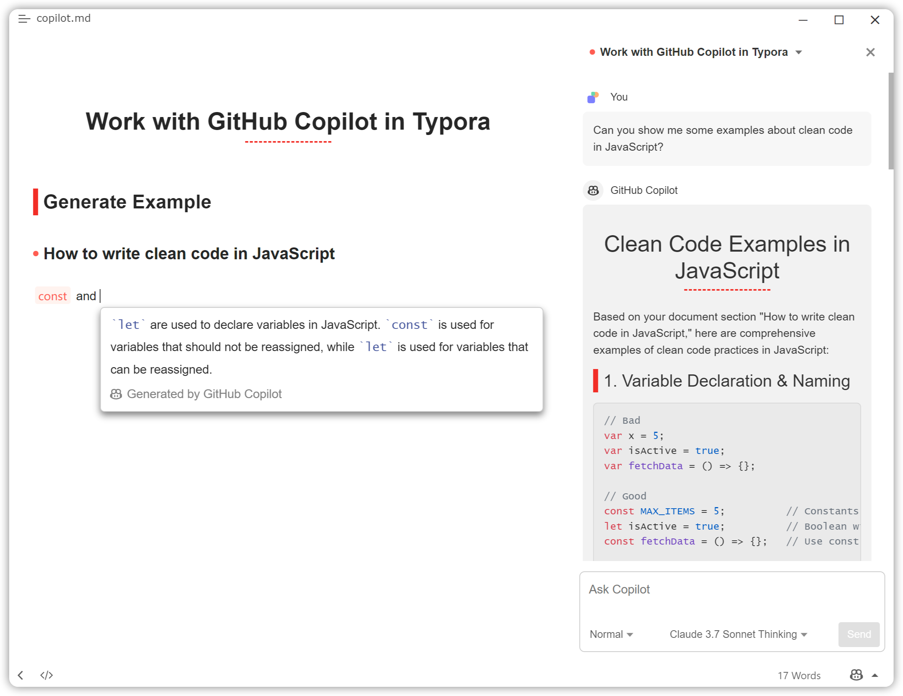

# Typora Copilot

English | [简体中文](./README.zh-CN.md)



[GitHub Copilot](https://github.com/features/copilot) plugin for [Typora](https://typora.io/) on both Windows, macOS and Linux, provided through [Copilot.vim](https://github.com/github/copilot.vim).

This plugin uses the LSP server extracted from Copilot.vim to provide suggestions in real-time right from your editor.

## Compatibility

> [!NOTE]
>
> For Windows / Linux users using Typora < 1.6 or macOS users using any version of Typora, you need to install [Node.js](https://nodejs.org/en/download/) ≥ 18.

_\*Note: `/` means not tested._

| Typora Version | Windows 11 | Ubuntu 22.04+ | macOS 14+ |
| -------------- | ---------- | ------------- | --------- |
| 1.9.5          | ✔         | /             | /         |
| 1.8.10         | ✔         | ✔            | ✔        |
| 1.8.8          | /          | ✔            | /         |
| 1.8.6          | ✔         | /             | /         |
| 1.8.5          | ✔         | /             | ✔        |
| 1.7.6          | ✔         | /             | /         |
| 1.6.7          | ✔         | /             | /         |
| 1.6.4-dev      | ✔         | /             | /         |
| 1.5.12         | ✔         | /             | /         |
| 1.4.8          | ✔         | /             | /         |
| 1.3.8          | ✔         | /             | /         |
| 1.2.5          | ✔         | /             | /         |
| 1.2.3          | ✔         | /             | /         |
| 1.0.3          | ✔         | /             | /         |
| 0.11.18-beta   | ✔         | /             | /         |

## Prerequisites

- Public network connection.
- Active GitHub Copilot subscription.

## Installation

### Automated Installation (Recommended)

To install the plugin, you can just copy and paste the following command into your terminal:

<details>
  <summary><strong>Windows</strong></summary>

Run the following command in PowerShell **as administrator**:

```powershell
iwr -Uri "https://raw.githubusercontent.com/Snowflyt/typora-copilot/main/install.ps1" | iex
```

</details>

<details>
  <summary><strong>macOS</strong></summary>

Run the following command in your terminal:

```bash
curl -fsSL https://raw.githubusercontent.com/Snowflyt/typora-copilot/main/install.sh | sudo bash
```

</details>

<details>
  <summary><strong>Linux</strong></summary>

Run the following command in your terminal:

```bash
wget -O - https://raw.githubusercontent.com/Snowflyt/typora-copilot/main/install.sh | sudo bash
```

</details>

### Script Install

<details>
  <summary><strong>Windows</strong></summary>

For Windows users, first download the latest release from [the releases page](https://github.com/Snowfly-T/typora-copilot/releases) and unzip it. Then locate to the folder where you unzipped the release and run the following command in PowerShell **as administrator**:

```powershell
.\bin\install_windows.ps1
```

If the script fails to find Typora, you can specify the path to Typora manually:

```powershell
.\bin\install_windows.ps1 -Path "C:\Program Files\Typora\" # Replace with your Typora path
# Or use the alias
# .\bin\install_windows.ps1 -p "C:\Program Files\Typora\" # Replace with your Typora path
```

</details>

<details>
  <summary><strong>macOS</strong></summary>

For macOS users, first download the latest release from [the releases page](https://github.com/Snowfly-T/typora-copilot/releases) and unzip it. Then locate to the folder where you unzipped the release and run the following command in terminal:

```bash
sudo bash ./bin/install_macos.sh
```

If the script fails to find Typora, you can specify the path to Typora manually:

```bash
sudo bash ./bin/install_macos.sh --path "/Applications/Typora.app/" # Replace with your Typora path
# Or use the alias
# sudo bash ./bin/install_macos.sh -p "/Applications/Typora.app/" # Replace with your Typora path
```

You’ll see a message logging the installation directory of the plugin. _Keep it in mind, you’ll need it when uninstalling the plugin._ After that, you can safely delete the release folder.

</details>

<details>
  <summary><strong>Linux</strong></summary>

For Linux users, first download the latest release from [the releases page](https://github.com/Snowfly-T/typora-copilot/releases) and unzip it. THen locate to the folder where you unzipped the release and run the following command in terminal:

```bash
sudo bash ./bin/install_linux.sh
```

If the script fails to find Typora, you can specify the path to Typora manually:

```bash
sudo bash ./bin/install_linux.sh --path "/usr/share/typora/" # Replace with your Typora path
# Or use the alias
# sudo bash ./bin/install_linux.sh -p "/usr/share/typora/" # Replace with your Typora path
```

You’ll see a message logging the installation directory of the plugin. _Keep it in mind, you’ll need it when uninstalling the plugin._ After that, you can safely delete the release folder.

</details>

### Manual Install

<details>
  <summary>Click to expand</summary>

1. Download the latest release from [the releases page](https://github.com/Snowfly-T/typora-copilot/releases) and unzip it.
2. For Windows / Linux users, find `window.html` in your Typora installation folder, usually located at `<typora_root_path>/resources/`; For macOS users, find `index.html` in your Typora installation folder, usually located at `<typora_root_path>/Contents/Resources/TypeMark/`. `<typora_root_path>` is the path where Typora is installed, replace it with your real Typora installation path (note that the angle brackets `<` and `>` should also be removed). This folder is called Typora resource folder in the following steps.
3. Create a folder named `copilot` in Typora resource folder.
4. Copy the downloaded release to the `copilot` folder.
5. For Windows / Linux users, open the previous `window.html` file you found in Typora resource folder with a text editor, and add `<script src="./copilot/index.js" defer="defer"></script>` right after something like `<script src="./appsrc/window/frame.js" defer="defer"></script>` or `<script src="./app/window/frame.js" defer="defer"></script>`; For macOS users, open the previous `index.html` file you found in Typora resource folder with a text editor, and add `<script src="./copilot/index.js" defer></script>` right after something like `<script src="./appsrc/main.js" aria-hidden="true" defer></script>` or `<script src="./app/main.js" aria-hidden="true" defer></script>`.
6. Restart Typora.
7. For macOS users, if you see a warning dialog saying Typora may be damaged, Ctrl-click Typora and select “Open” to open Typora.
</details>

## Setup

When finished installation, you'll find an icon in the toolbar of Typora (i.e. the bottom-right corner of Typora). Click it to open the panel of Copilot, and then click “Sign in to authenticate Copilot”.


Follow the prompts to authenticate Copilot plugin:

1. The User Code will be auto copied to your clipboard.
2. Follow the instructions on the pop-up dialog to open the GitHub authentication page in your browser.
3. Paste the User Code into the GitHub authentication page.
4. Return to Typora and press OK on the dialog.
5. If you see a “Signed in to Copilot” dialog _after a few seconds_, Copilot plugin should start working since then.

## Uninstallation

### Automated Uninstallation (Recommended)

To uninstall the plugin, you can just copy and paste the following command into your terminal:

<details>
  <summary><strong>Windows</strong></summary>

Run the following command in PowerShell **as administrator**:

```powershell
iwr -Uri "https://raw.githubusercontent.com/Snowflyt/typora-copilot/main/bin/uninstall_windows.ps1" | iex
```

</details>

<details>
  <summary><strong>macOS</strong></summary>

Run the following command in your terminal:

```bash
curl -fsSL https://raw.githubusercontent.com/Snowflyt/typora-copilot/main/bin/uninstall_macos.sh | sudo bash
```

</details>

<details>
  <summary><strong>Linux</strong></summary>

Run the following command in your terminal:

```bash
wget -O - https://raw.githubusercontent.com/Snowflyt/typora-copilot/main/bin/uninstall_linux.sh | sudo bash
```

</details>

### Script Uninstall

<details>
  <summary><strong>Windows</strong></summary>

For Windows users, locate to the installation directory of the plugin and run the following command in PowerShell **as administrator**.

```powershell
.\bin\uninstall_windows.ps1
```

You can still specify the path to Typora manually by adding `-Path` or `-p`, just like the installation script.

</details>

<details>
  <summary><strong>macOS</strong></summary>

For macOS users, locate to the installation directory of the plugin and run the following command in terminal.

```bash
sudo bash ./bin/uninstall_macos.sh
```

You can still specify the path to Typora manually by adding `--path` or `-p`, just like the installation script.

</details>

<details>
  <summary><strong>Linux</strong></summary>

For Linux users, locate to the installation directory of the plugin and run the following command in terminal.

```bash
sudo bash ./bin/uninstall_linux.sh
```

You can still specify the path to Typora manually by adding `--path` or `-p`, just like the installation script.

</details>

### Manual Uninstall

<details>
  <summary>Click to expand</summary>

1. For Windows / Linux users, find `window.html` in your Typora installation folder, usually located at `<typora_root_path>/resources/`; For macOS users, find `index.html` in your Typora installation folder, usually located at `<typora_root_path>/Contents/Resources/TypeMark/`. `<typora_root_path>` is the path where Typora is installed, replace it with your real Typora installation path (note that the angle brackets `<` and `>` should also be removed). This folder is called Typora resource folder in the following steps.
2. Delete the `copilot` folder in Typora resource folder.
3. For Windows / Linux users, open the previous `window.html` file you found in Typora resource folder with a text editor, and delete `<script src="./copilot/index.js" defer="defer"></script>`; For macOS users, open the previous `index.html` file you found in Typora resource folder with a text editor, and delete `<script src="./copilot/index.js" defer></script>`.
4. Restart Typora.
</details>

## Known Issues

1. Sometimes accepting a suggestion may cause the editor rerendering (i.e. code blocks, math blocks, etc. will be rerendered). This is due to the limitation of Typora's API that I have to force the editor to rerender sometimes to accept a suggestion, and currently I can't find a more safe and efficient way to resolve this issue.

## FAQs

### How to temporarily disable Copilot?

Just click the Copilot icon in the toolbar, and then click “Disable completions”. You can enable it again by clicking the icon and then clicking “Enable completions”.

### Why use suggestion panel in live preview mode (normal mode) and completion text in source mode by default? Can I change that?

The usage of suggestion panel in live preview mode is intentional. Typora uses a complex mechanism to render the content in live preview mode, it is hard to make completion text work properly in live preview mode.

But it is possible to also use suggestion panel in source mode, you can click the `toolbar icon -> Settings` and toggle the `Use inline completion text in source mode` option.

An option called `Use inline completion text in preview code blocks` is also provided. If you enable this option, the completion text instead of suggestion panel will also be used in code blocks and math blocks in live preview mode. But it is currently not recommended to enable this option, as it is likely to corrupt the editor content or history.

### Can I use keys other than `Tab` to accept suggestions?

Currently, no. It is technically possible, but currently I don't have enough time to implement it. Maybe I will implement it in the future.
