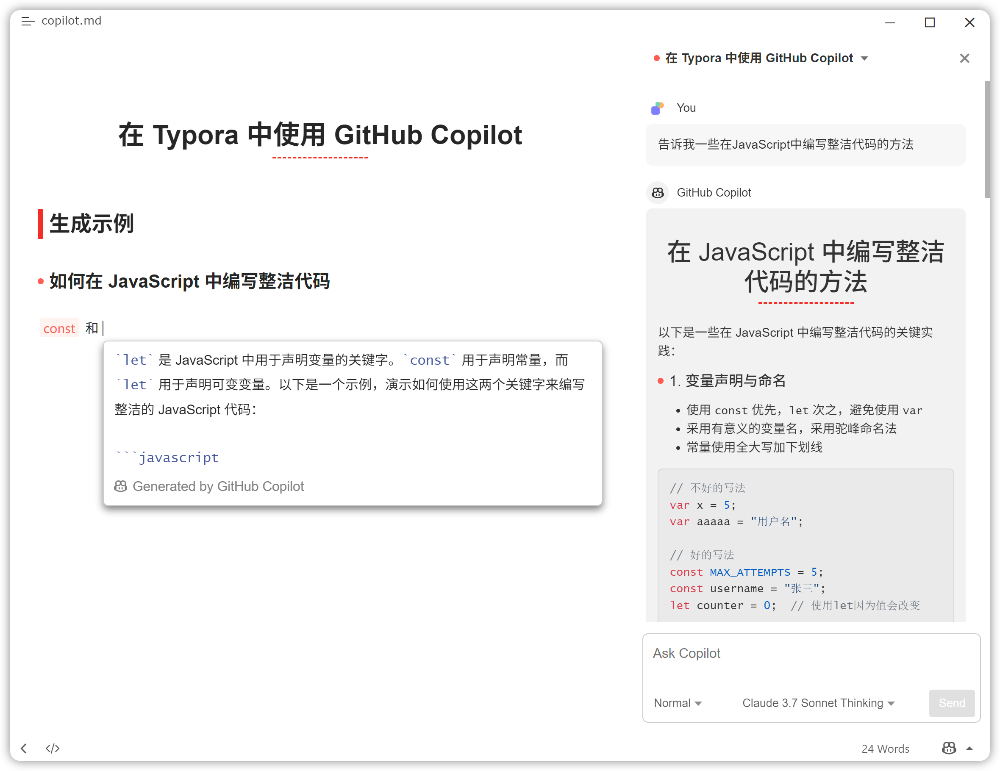

# Typora Copilot

[English](./README.md) | 简体中文



[Typora](https://typora.io/) 的 [GitHub Copilot](https://github.com/features/copilot) 插件，支持 Windows、macOS 和 Linux，由 [Copilot.vim](https://github.com/github/copilot.vim) 提供支持。

该插件使用从 Copilot.vim 提取的 LSP 服务器，以在编辑器中实时提供建议。

## 兼容性

> [!NOTE]
>
> 自 Typora v1.10 起，所有平台都需要安装 [Node.js](https://nodejs.org/zh-cn/download) ≥ 18 才能使用本插件。
>
> （仅对于使用 1.6 ≤ Typora < 1.10 的 Windows / Linux 用户，无需安装 Node.js。:wink:）

_\*注：`/` 表示未经过测试。_

| Typora Version | Windows 11 | Ubuntu 22.04 | macOS 14.x/15.x |
| -------------- | ---------- | ------------ | --------------- |
| 1.10.5-dev     | ✓         | /            | ✓              |
| 1.9.5          | ✓         | /            | /               |
| 1.9.4          | /          | /            | ✓              |
| 1.9.3          | /          | ✓           | /               |
| 1.8.10         | ✓         | ✓           | ✓              |
| 1.8.8          | /          | ✓           | /               |
| 1.8.6          | ✓         | /            | /               |
| 1.8.5          | ✓         | /            | ✓              |
| 1.7.6          | ✓         | /            | /               |
| 1.6.7          | ✓         | /            | /               |
| 1.6.4-dev      | ✓         | /            | /               |
| 1.5.12         | ✓         | /            | /               |
| 1.4.8          | ✓         | /            | /               |
| 1.3.8          | ✓         | /            | /               |
| 1.2.5          | ✓         | /            | /               |
| 1.2.3          | ✓         | /            | /               |
| 1.0.3          | ✓         | /            | /               |
| 0.11.18-beta   | ✓         | /            | /               |

## 前置条件

- 公网连接（对于中国大陆用户，你还需要确保你的网络可以正常访问 GitHub Copilot 服务）。
- 已激活的 GitHub Copilot 订阅。

## 安装

### 一键安装（推荐）

你可以直接将以下命令复制粘贴到你的终端中来安装插件：

<details>
  <summary><strong>Windows</strong></summary>

以**管理员身份**在 PowerShell 中运行以下命令：

```powershell
iwr -Uri "https://raw.githubusercontent.com/Snowflyt/typora-copilot/main/install.ps1" | iex
```

</details>

<details>
  <summary><strong>macOS</strong></summary>

在终端中运行以下命令：

```bash
curl -fsSL https://raw.githubusercontent.com/Snowflyt/typora-copilot/main/install.sh | sudo bash
```

</details>

<details>
  <summary><strong>Linux</strong></summary>

在终端中运行以下命令：

```bash
wget -O - https://raw.githubusercontent.com/Snowflyt/typora-copilot/main/install.sh | sudo bash
```

</details>

### 脚本安装

<details>
  <summary><strong>Windows</strong></summary>

对于 Windows 用户，首先从[发布页面](https://github.com/Snowflyt/typora-copilot/releases)下载最新版本并解压。然后定位到你解压的文件夹并在 PowerShell 中**以管理员身份**运行以下命令：

```powershell
.\bin\install_windows.ps1
```

如果脚本无法找到 Typora，你可以手动指定 Typora 的路径：

```powershell
.\bin\install_windows.ps1 -Path "C:\Program Files\Typora\" # 替换为你的 Typora 路径
# 或使用别名
# .\bin\install_windows.ps1 -p "C:\Program Files\Typora\" # 替换为你的 Typora 路径
```

安装过程中，你会看到一条消息记录插件的安装目录。_记住它，在卸载插件时你会需要它。_ 安装完成后，你可以安全地删除刚才解压的文件夹。

</details>

<details>
  <summary><strong>macOS</strong></summary>

对于 macOS 用户，首先从[发布页面](https://github.com/Snowflyt/typora-copilot/releases)下载最新版本并解压。然后定位到你解压的文件夹并在终端中运行以下命令：

```bash
sudo bash ./bin/install_macos.sh
```

如果脚本无法找到 Typora，你可以手动指定 Typora 的路径：

```bash
sudo bash ./bin/install_macos.sh --path "/Applications/Typora.app/" # 替换为你的 Typora 路径
# 或使用别名
# sudo bash ./bin/install_macos.sh -p "/Applications/Typora.app/" # 替换为你的 Typora 路径
```

安装过程中，你会看到一条消息记录插件的安装目录。_记住它，在卸载插件时你会需要它。_ 安装完成后，你可以安全地删除刚才解压的文件夹。

</details>

<details>
  <summary><strong>Linux</strong></summary>

对于 Linux 用户，首先从[发布页面](https://github.com/Snowflyt/typora-copilot/releases)下载最新版本并解压。然后定位到你解压的文件夹并在终端中运行以下命令：

```bash
sudo bash ./bin/install_linux.sh
```

如果脚本无法找到 Typora，你可以手动指定 Typora 的路径：

```bash
sudo bash ./bin/install_linux.sh --path "/usr/share/typora/" # 替换为你的 Typora 路径
# 或使用别名
# sudo bash ./bin/install_linux.sh -p "/usr/share/typora/" # 替换为你的 Typora 路径
```

安装过程中，你会看到一条消息记录插件的安装目录。_记住它，在卸载插件时你会需要它。_ 安装完成后，你可以安全地删除刚才解压的文件夹。

</details>

### 手动安装

<details>
  <summary>点击展开</summary>

1. 从[发布页面](https://github.com/Snowflyt/typora-copilot/releases)下载最新版本并解压。
2. 找到 Typora 安装目录下的 `window.html` 文件，通常位于 `<typora_root_path>/resources/`；对于 macOS 用户，找到 Typora 安装目录下的 `index.html` 文件，通常位于 `<typora_root_path>/Contents/Resources/TypeMark/`。`<typora_root_path>` 是 Typora 的安装路径，替换为你的实际 Typora 安装路径（注意尖括号 `<` 和 `>` 也要删除）。这个文件夹在下面的步骤中被称为 Typora 资源文件夹。
3. 在 Typora 资源文件夹中创建一个名为 `copilot` 的文件夹。
4. 将解压出的文件全局复制到 `copilot` 文件夹中。
5. 对于 Windows / Linux 用户，在 Typora 资源文件夹中用文本编辑器打开 `window.html`，在类似 `<script src="./appsrc/window/frame.js" defer="defer"></script>` 或 `<script src="./app/window/frame.js" defer="defer"></script>` 的代码之后添加 `<script src="./copilot/index.js" defer="defer"></script>`；对于 macOS 用户，在 Typora 资源文件夹中用文本编辑器打开 `index.html`，在类似 `<script src="./appsrc/main.js" aria-hidden="true" defer></script>` 或 `<script src="./app/main.js" aria-hidden="true" defer></script>` 的代码之后添加 `<script src="./copilot/index.js" defer></script>`。
6. 重启 Typora。
7. 对于 macOS 用户，如果你在打开 Typora 时被提示“文件已损坏”，你可以按住 Ctrl 点击 Typora，并选择“打开”来打开 Typora.
</details>

## 初始化

完成安装后，你会在 Typora 工具栏（即界面底部右下角）找到一个 Copilot 图标。点击它打开 Copilot 面板，然后点击“登录以认证 Copilot”。


> [!CAUTION]
>
> 如果你在中国大陆，登录这一步很可能因为网络原因失败。如果你发现点击按钮后很长时间没有反应，尝试按 Shift+F12（Windows 或 Linux）或在帮助菜单中打开“Enable Debugging”并在任意位置右键选择检查元素（macOS），以打开调试工具，定位到“控制台”或“Console”标签页，将过滤级别调整为“详细”或“Verbose”。然后查看控制台中打印的日志信息，以检查是否存在网络问题。
>
> 如果你看到一条来自“SignInInitiate”的红色错误信息，其中包含“ETIMEOUT”这样的内容，说明这一步因网络原因失败了。尝试调整你的代理软件设置，打开类似“增强代理”或“TUN 模式”的选项，重启 Typora 再进行尝试；或者，对于 Windows 用户可以使用使用 Proxifier 配置全局代理，对于 macOS / Linux 用户可以使用 Proxychains 打开 Typora，再进行尝试。

按照提示进行身份验证：

1. 用户代码会自动复制到你的剪贴板。
2. 遵照弹出提示上的说明，打开 GitHub 身份验证页面。
3. 将用户代码粘贴到 GitHub 身份验证页面中。
4. 返回 Typora 并在对话框中按下“确定”按钮。
5. 如果你在**几秒钟后**看到一个“已登录 GitHub Copilot”对话框，Copilot 插件应该就可以正常工作了（在中国大陆，你可能需要等待更长的时间）。

## 卸载

### 一键卸载（推荐）

要卸载插件，你可以直接将以下命令复制粘贴到你的终端中：

<details>
  <summary><strong>Windows</strong></summary>

以**管理员身份**在 PowerShell 中运行以下命令：

```powershell
iwr -Uri "https://raw.githubusercontent.com/Snowflyt/typora-copilot/main/bin/uninstall_windows.ps1" | iex
```

</details>

<details>
  <summary><strong>macOS</strong></summary>

在终端中运行以下命令：

```bash
curl -fsSL https://raw.githubusercontent.com/Snowflyt/typora-copilot/main/bin/uninstall_macos.sh | sudo bash
```

</details>

<details>
  <summary><strong>Linux</strong></summary>

在终端中运行以下命令：

```bash
wget -O - https://raw.githubusercontent.com/Snowflyt/typora-copilot/main/bin/uninstall_linux.sh | sudo bash
```

</details>

### 脚本卸载

<details>
  <summary><strong>Windows</strong></summary>

对于 Windows 用户，定位到插件安装目录并在 PowerShell 中**以管理员身份**运行以下命令：

```powershell
.\bin\uninstall_windows.ps1
```

和安装时一样，如果脚本无法找到 Typora，你可以手动通过 `-Path` 或 `-p` 参数指定 Typora 的路径。

</details>

<details>
  <summary><strong>macOS</strong></summary>

对于 macOS 用户，定位到插件安装目录并在终端中运行以下命令：

```bash
sudo bash ./bin/uninstall_macos.sh
```

和安装时一样，如果脚本无法找到 Typora，你可以手动通过 `--path` 或 `-p` 参数指定 Typora 的路径。

</details>

<details>
  <summary><strong>Linux</strong></summary>

对于 Linux 用户，定位到插件安装目录并在终端中运行以下命令：

```bash
sudo bash ./bin/uninstall_linux.sh
```

和安装时一样，如果脚本无法找到 Typora，你可以手动通过 `--path` 或 `-p` 参数指定 Typora 的路径。

</details>

### 手动卸载

<details>
  <summary>点击展开</summary>

1. 找到 Typora 安装目录下的 `window.html` 文件，通常位于 `<typora_root_path>/resources/`；对于 macOS 用户，找到 Typora 安装目录下的 `index.html` 文件，通常位于 `<typora_root_path>/Contents/Resources/TypeMark/`. `<typora_root_path>` 是 Typora 的安装路径，替换为你的实际 Typora 安装路径（注意尖括号 `<` 和 `>` 也要删除）。这个文件夹在下面的步骤中被称为 Typora 资源文件夹。
2. 删除 Typora 资源文件夹中的 `copilot` 文件夹。
3. 对于 Windows / Linux 用户，在 Typora 资源文件夹中用文本编辑器打开 `window.html`，删除 `<script src="./copilot/index.js" defer="defer"></script>`；对于 macOS 用户，在 Typora 资源文件夹中用文本编辑器打开 `index.html`，删除 `<script src="./copilot/index.js" defer></script>`.
4. 重启 Typora.
</details>

## 已知问题

1. 有时接受建议可能会导致编辑器重新渲染（即代码块、数学块等将重新渲染）。这是由于 Typora API 的限制，我必须有时强制编辑器重新渲染以接受建议，目前我找不到更安全和更高效的方法来解决这个问题。

## 常见问题

### 如何临时禁用 Copilot？

点击工具栏中的 Copilot 图标，然后点击“禁用建议”即可。你可以通过点击图标然后点击“启用建议”来重新启用它。

### 为什么默认在实时预览模式（正常模式）下使用建议面板，在源代码模式下使用补全文本？我能修改这一配置吗？

在实时预览模式下使用建议面板是有意的。Typora 在实时预览模式下的渲染机制很复杂，很难使补全文本在实时预览模式下正常工作。

不过对于源代码模式，你可以通过点击 `工具栏图标 -> 设置` 并切换 `在源代码模式下使用内联补全文本` 选项来在源代码模式下使用建议面板。

设置中还提供了一个名为 `在预览模式代码块中使用内联补全文本` 的选项。如果你启用了这个选项，补全文本将会在实时预览模式下的代码块和数学块中使用。但目前不建议启用这个选项，因为它很可能会破坏编辑器内容或历史记录。

### 我可以使用除 `Tab` 键以外的按键来接受建议吗？

目前不行。这在技术上是可行的，但目前我没什么时间实现它。也许我将来会实现它。
